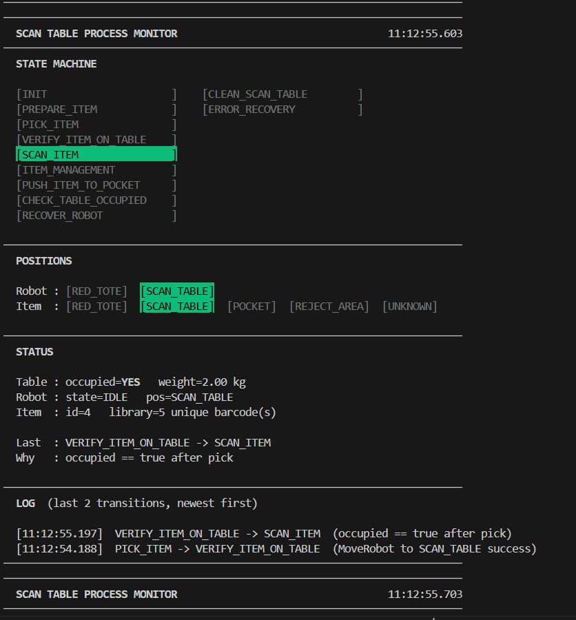

# Scan Table System

This is an robot-scanner-pusher table simulator, demostrating the following workflow
1. Robot picks and places item on the Scan Table
2. The system acquires barcodes from the scanners.
3. System assigns barcodes to the item
4. System actuates the pusher to clear the table.
5. The system signals ready-for-next-item only once the table is confirmed clear


## system modules

The system is composed of five packages:

- **scan_table_interfaces** — shared ROS2 message and service definitions used across all packages.
- **hardware_simulation** — five mock nodes that simulate the physical hardware:
  - `item_mock` — ground truth for item position and barcode data; handles spawn and move requests. Instead of generating random items, it cycles through 5 predefined items in order (repeating after item 5), each designed to exercise a distinct barcode scenario: identical barcodes across two faces, identical barcodes on the same face, no barcodes, full six-face coverage, and conflicting barcode IDs. All items use a fixed weight of 2.0 kg.
  - `robot_mock` — simulates the robot arm; moves between RED_TOTE and SCAN_TABLE, carrying the item when picking.
  - `scanner_mock` — simulates six face-scanners; operates in triggered mode and returns barcodes found on the item when triggered.
  - `pusher_mock` — simulates the pusher mechanism; moves the item to POCKET or REJECT_AREA on command.
  - `table_sensor_mock` — simulates a weight/presence sensor; reports scan table occupancy derived from item state.
- **scan_table_manager** — the central C++ state machine node that orchestrates the full workflow by calling hardware services and reacting to sensor topics.
- **scanning_process_monitor** — a read-only Python monitor node that renders a live terminal dashboard showing state machine status, positions, sensor readings, and a rolling log.
- **robot_scanner_bringup** — top-level launch package that starts all hardware simulation nodes and the scan_table_manager together.

More details of the system modules can be found in the [system modules](./doc/module_description.md) file.


## scan_table_manager state machine

The state machine runs at 1 Hz and drives the following repeating cycle:

1. **INIT** — entry point, transitions immediately to PREPARE_ITEM.
2. **PREPARE_ITEM** — spawns a new item in the RED_TOTE via `/item/spawn`.
3. **PICK_ITEM** — commands the robot to pick the item and place it on the scan table via `/robot/move`.
4. **VERIFY_ITEM_ON_TABLE** — confirms the scan table sensor reports `occupied=true` before proceeding.
5. **SCAN_ITEM** — triggers the barcode scanners via `/scanner/trigger` and collects results. On hardware failure goes to ERROR_RECOVERY; on success (including zero barcodes) always goes to ITEM_MANAGEMENT.
6. **ITEM_MANAGEMENT** — deduplicates barcodes, updates the item library, and classifies the item. Single unique barcode ID → PUSH_ITEM_TO_POCKET; zero barcodes or multiple distinct barcode IDs → CLEAN_SCAN_TABLE.
7. **PUSH_ITEM_TO_POCKET** — actuates the pusher toward POCKET via `/pusher/push`.
8. **CHECK_TABLE_OCCUPIED** — checks whether the table is clear after pushing; if still occupied, routes to CLEAN_SCAN_TABLE.
9. **CLEAN_SCAN_TABLE** — pushes the item toward REJECT_AREA as a fallback clearance step.
10. **RECOVER_ROBOT** — returns the robot to RED_TOTE, ready for the next cycle.
11. **ERROR_RECOVERY** — logs the error, waits 2 seconds, and retries from PREPARE_ITEM.

On any service call failure the machine falls into **ERROR_RECOVERY** and retries. Hardware mocks simulate a **5% random failure rate** to exercise these paths.

More details of the state machine can be found in the [state_machine](./doc/StateMachine.md) file.


## local deployment

> **Note:** This project was developed in a **WSL2 environment on Windows 11**. The `run_ros2_docker_no_display.sh` script has been modified specifically for WSL2 and may or may not work on a native Ubuntu host. If it fails, try the alternative `./run_ros2_docker.sh` instead.

prerequisit : docker
```bash
sudo ./run_ros2_docker_no_display.sh
```
It automatically detects if the container is built, builds it if not, then enters the container and mounts the `src`, `build`, `log`, and `install` folders as volumes.

After entering the container, build the workspace:
```bash
colcon build
```

Then source the workspace:
```bash
source install/setup.bash
```

This only needs to be done once after the first build. Subsequently, `entrypoint.sh` will automatically source the workspace on container entry.

### launch system

This launches the scan_table_manager and all hardware simulation nodes. The state machine runs at 1 Hz.

```bash
ros2 launch robot_scanner_bringup bringup.launch.py
```

The output will look like this:

```
[scan_table_manager-1] [INFO] [scan_table_manager]: CHECK_TABLE_OCCUPIED -> RECOVER_ROBOT  (occupied == false)
[robot_mock-3]         [INFO] [robot_mock]:          Robot moved to position 0
[scan_table_manager-1] [INFO] [scan_table_manager]: RECOVER_ROBOT -> PREPARE_ITEM  (MoveRobot to RED_TOTE success)
[item_mock-2]          [INFO] [item_mock]:           Spawned item 1 (slot: two-faces) with 2 barcodes, weight=2.0 kg
[scan_table_manager-1] [INFO] [scan_table_manager]: Spawned item id=1
[scan_table_manager-1] [INFO] [scan_table_manager]: PREPARE_ITEM -> PICK_ITEM  (SpawnItem success, item_id=1)
[item_mock-2]          [INFO] [item_mock]:           Item 1 moved to position 1
[robot_mock-3]         [INFO] [robot_mock]:          Robot moved to position 1
[scan_table_manager-1] [INFO] [scan_table_manager]: PICK_ITEM -> VERIFY_ITEM_ON_TABLE  (MoveRobot to SCAN_TABLE success)
[scan_table_manager-1] [INFO] [scan_table_manager]: VERIFY_ITEM_ON_TABLE -> SCAN_ITEM  (occupied == true after pick)
[scanner_mock-4]       [INFO] [scanner_mock]:        Scan complete: 2 barcodes found
[scan_table_manager-1] [INFO] [scan_table_manager]: SCAN_ITEM -> ITEM_MANAGEMENT  (scan success, 2 barcode(s) found)
[scan_table_manager-1] [INFO] [scan_table_manager]: Item 1 — 1 unique barcode(s):
[scan_table_manager-1] [INFO] [scan_table_manager]:   barcode_id=AAAA1111  face=1  total_seen=1
```

### monitor

For better observation, open a second terminal and enter the container:
```bash
docker exec -it ros2_container /bin/bash
```
Once inside, the workspace is sourced automatically. Run the monitor node:
```bash
ros2 run scanning_process_monitor monitor
```



### Desired output

`item_mock` cycles through 5 predefined items in order, repeating after item 5. Each item exercises a distinct barcode scenario:

| Item | Slot label | Barcodes | Unique IDs | Expected outcome |
|---|---|---|---|---|
| 1 | `two-faces` | 2 (same ID, 2 different faces) | 1 (`AAAA1111`) | → PUSH_ITEM_TO_POCKET |
| 2 | `same-face` | 2 (same ID, same face) | 1 (`BBBB2222`) | → PUSH_ITEM_TO_POCKET |
| 3 | `no-barcode` | 0 | 0 | → CLEAN_SCAN_TABLE |
| 4 | `full-scan` | 6 (same ID, all 6 faces) | 1 (`CCCC3333`) | → PUSH_ITEM_TO_POCKET |
| 5 | `conflicting` | 4 (two distinct IDs across faces) | 2 (`DDDD4444`, `EEEE5555`) | → CLEAN_SCAN_TABLE |

After item 5 the cycle repeats from item 1.

Hardware errors can occur at any time — each service call in `robot_mock`, `scanner_mock`, and `pusher_mock` has a **5% random failure rate**. When a failure occurs, the state machine transitions to **ERROR_RECOVERY**, waits 2 seconds (simulating manual intervention), and retries from **PREPARE_ITEM**, and deleted the failed item, start from next item.

---

## Q&A — Task A: System Architecture

### Software

**Q: Make a state diagram for the system.**

A: See the state diagram in the [scan_table_manager state machine](#scan_table_manager-state-machine) section above, and the detailed diagram in [`doc/state_diagram.drawio.svg`](./doc/state_diagram.drawio.svg).

---

**Q: How would you structure your nodes? How should they communicate with each other?**

A: The system is divided into four functional layers, each implemented as one or more ROS2 nodes:

- **Hardware simulation nodes** (`item_mock`, `robot_mock`, `scanner_mock`, `pusher_mock`, `table_sensor_mock`) — each node encapsulates a single physical device and exposes a ROS2 service interface for commanding that device.
- **Central orchestrator** (`scan_table_manager`) — a single state machine node that drives the full workflow by calling hardware services and reacting to sensor data.
- **Monitor node** (`scanning_process_monitor`) — a read-only observer node that subscribes to state topics and renders a live dashboard.
- **Bringup package** (`robot_scanner_bringup`) — launches all nodes together.

Communication follows two patterns:
- **Services** are used for all hardware actions (spawn item, move robot, trigger scanner, actuate pusher). This ensures synchronous, request-response semantics where the caller waits for confirmation before advancing the state machine.
- **Topics** are used for sensor state (e.g., table occupancy). These are published continuously by the hardware nodes and consumed by both the state machine and the monitor without tight coupling.

---

### Hardware

**Q: How many scanners do we need, and how should they be mounted?**

A: Six scanners are required — one per face of the item — so that all six faces can be scanned simultaneously in a single trigger cycle, without any need to reposition the item. Five scanners are fixed at orthogonal angles covering the four sides and the bottom. The top scanner is mounted at a slight inward tilt to keep its field of view clear of the robot arm during placement, while still reliably covering the top face.

---

**Q: Do we need to add extra sensors? Which ones?**

A: Yes. In addition to the six barcode scanners, a force or weight sensor on the scan table surface is recommended. This sensor serves two purposes: it confirms that an item is physically present before scanning begins, and it detects edge cases such as an item slipping off the table or an item with no readable barcodes on any face. Without this sensor, the system would have no reliable way to distinguish a correctly cleared table from a table that was never occupied in the first place.
